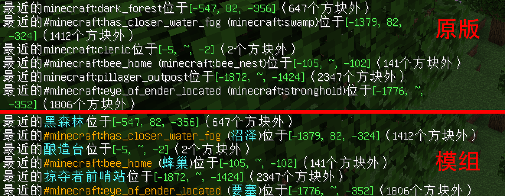

	<a href="./README-en.md"><b>English Version</b></a>

	

<h1 align="center">
	标识符翻译
</h1> 

	将命令反馈与命令建议中的生物群系、地物和结构显示为对应翻译而非标识符。

	
	
	

    

## 链接

[GitHub](https://github.com/Yeah-Zero/Identifier-Translation) [CurseForge](https://www.curseforge.com/minecraft/mc-mods/identifier-translation) [Modrinth](https://modrinth.com/mod/identifier-translation) [我的世界中文论坛]() [MC百科](https://www.mcmod.cn/class/8657.html)

### 依赖项

Cloth Config（[GitHub](https://github.com/shedaniel/cloth-config) [CurseForge](https://www.curseforge.com/minecraft/mc-mods/cloth-config) [Modrinth](https://modrinth.com/mod/cloth-config)）

Fabric API（[GitHub](https://github.com/FabricMC/fabric) [CurseForge](https://www.curseforge.com/minecraft/mc-mods/fabric-api) [Modrinth](https://modrinth.com/mod/fabric-api)）

Fabric Loader（[官网](https://fabricmc.net/) [GitHub](https://github.com/FabricMC/fabric-loader)）

### 说明

生物群系翻译取自游戏内语言文件，地物（仅中文）和结构翻译取自[Minecraft Wiki](https://minecraft.fandom.com/zh/wiki/Minecraft_Wiki)。

涉及命令：`/fillbiome`、`/locate`和`/place`。

配置文件保存在“<游戏目录>\config\标识符翻译.json”。

模组图标不代表本人任何立场。
